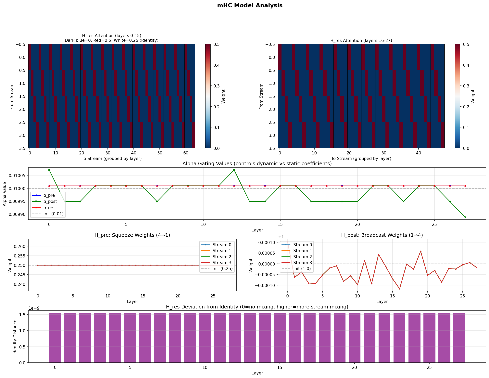

# mHC: Manifold-Constrained Hyper-Connections for Qwen3-0.6B

## Project Overview

This project implements **Manifold-Constrained Hyper-Connections (mHC)** to expand the Qwen3-0.6B model architecture. mHC is a technique developed by DeepSeek-AI that extends the standard residual connection paradigm by:

1. **Expanding the residual stream width** from C to n×C (where n=4 is the expansion rate)
2. **Adding learnable connection matrices** that control how information flows between layers
3. **Constraining these matrices** to a doubly stochastic manifold to ensure training stability

The key innovation of mHC over standard Hyper-Connections (HC) is the **manifold constraint** that prevents signal explosion/vanishing during training by ensuring the residual mapping matrices are doubly stochastic (rows and columns sum to 1).

## Key Features

- **Warm Start Conversion**: Initialize mHC matrices to be mathematically equivalent to the original model
- **Training Stability**: Doubly stochastic constraint ensures bounded signal propagation
- **Minimal Overhead**: Only ~6.7% additional training time with optimized kernels
- **Scalability**: Proven effective at 27B+ parameter scale

## Architecture Comparison

```
Standard Residual:     x_{l+1} = x_l + F(x_l, W_l)

Hyper-Connections:     x_{l+1} = H_l^res @ x_l + H_l^post.T @ F(H_l^pre @ x_l, W_l)

mHC (Ours):            x_{l+1} = P_M(H_l^res) @ x_l + H_l^post.T @ F(H_l^pre @ x_l, W_l)
                       where P_M projects onto doubly stochastic manifold
```

## Analysis Results

The following visualization shows the mHC parameter analysis after a **short 10-minute test training session**:



**Key observations from this minimal training run:**
- **H_res matrices** remain close to identity (diagonal pattern visible in top heatmaps)
- **Alpha gating values** show minor fluctuations around the init value of 0.01
- **H_pre weights** stay uniform at 0.25 (equal stream contributions)
- **H_post weights** show tiny variations around 1.0
- **Identity distance** is near zero (1e-9 scale) - streams haven't diverged yet

With longer training, we would expect:
- H_res matrices to develop off-diagonal mixing patterns
- Streams to specialize and diverge (lower cross-stream similarity)
- Alpha values to increase as dynamic coefficients become more important

## Documentation

- **[SPEC.md](SPEC.md)** - Complete technical specification with all implementation details
- This README - Quick overview and getting started guide

## Quick Start

### 1. Install Dependencies

```bash
pip install -r requirements.txt
```

### 2. Convert Qwen3-0.6B to mHC

```python
from src.conversion import convert_qwen3_to_mhc

# Load original model and convert
mhc_model = convert_qwen3_to_mhc(
    model_name_or_path="Qwen/Qwen3-0.6B",
    expansion_rate=4,
    output_path="./qwen3-0.6b-mhc"
)
```

### 3. Validate Equivalence

```python
from scripts.validate_equivalence import validate_conversion

# Ensure converted model produces identical outputs
is_equivalent = validate_conversion(
    original_model="Qwen/Qwen3-0.6B",
    mhc_model="./qwen3-0.6b-mhc",
    tolerance=1e-5
)
```

### 4. Fine-tune the mHC Model

```bash
python scripts/train_mhc.py \
    --model_path ./qwen3-0.6b-mhc \
    --data_path /path/to/data \
    --output_dir ./output \
    --learning_rate 8.6e-4
```

## Analysis Scripts

After training, you can analyze the mHC model's learned parameters:

### Visualize Stream Transformations
```bash
# Summary of parameter drift across all layers + detailed view
python -m scripts.visualize_streams --mhc ./path/to/trained/model

# Analyze a specific layer
python -m scripts.visualize_streams --mhc ./path/to/trained/model --layer 14
```

### Full Parameter Analysis
```bash
# Analyze alpha values, H_res matrices, and training drift
python -m scripts.analyze_mhc --mhc ./path/to/trained/model --layers 4
```

### Generate Matplotlib Visualization
```bash
# Create mhc_analysis.png with heatmaps and graphs
python -m scripts.plot_mhc --mhc ./path/to/trained/model

# ASCII output (no matplotlib required)
python -m scripts.plot_mhc --mhc ./path/to/trained/model --ascii
```

### Compare Generation
```bash
# Compare text generation between original and mHC model
python -m scripts.compare_generation --mhc ./path/to/trained/model
```

**What to look for after training:**
- **H_res identity distance > 0**: Streams are mixing!
- **Alpha values changing from 0.01**: Dynamic coefficients matter
- **H_pre not uniform [0.25]*4**: Some streams contribute more
- **Cross-stream similarity < 1.0**: Streams have specialized

## Base Model Specifications

**Qwen3-0.6B Configuration:**
| Parameter | Value |
|-----------|-------|
| hidden_size | 1024 |
| intermediate_size | 3072 |
| num_hidden_layers | 28 |
| num_attention_heads | 16 |
| num_key_value_heads | 8 |
| head_dim | 128 |
| vocab_size | 151936 |
| max_position_embeddings | 40960 |
| hidden_act | silu |
| rms_norm_eps | 1e-6 |
| tie_word_embeddings | true |

**mHC Expansion Parameters:**
| Parameter | Value |
|-----------|-------|
| expansion_rate (n) | 4 |
| gating_factor_init (α) | 0.01 |
| sinkhorn_iterations | 20 |

## Memory and Compute Estimates

After mHC expansion:
- **Residual stream width**: 1024 → 4096 (4×)
- **Additional parameters per layer**: ~66K (for H_pre, H_post, H_res mappings)
- **Total additional parameters**: ~1.8M across 28 layers
- **Memory overhead**: ~4× for residual activations (mitigated by recomputation)

## References

- [mHC: Manifold-Constrained Hyper-Connections](https://arxiv.org/abs/2512.24880) - DeepSeek-AI
- [Qwen3 Technical Report](https://arxiv.org/abs/2505.09388) - Alibaba
- [Hyper-Connections](https://arxiv.org/abs/2409.19606) - Original HC paper

## License

Apache 2.0 (following Qwen3 license)
