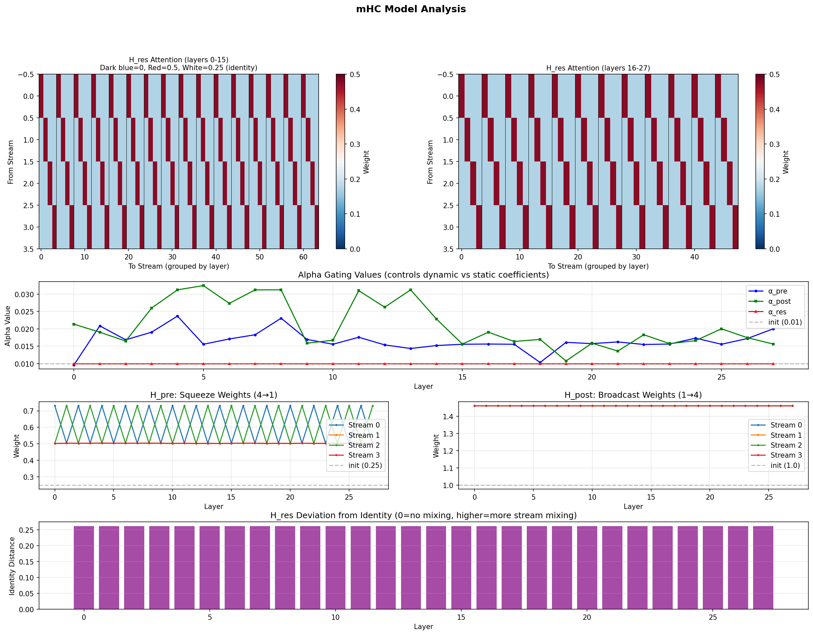

# mHC: Manifold-Constrained Hyper-Connections for Qwen3-0.6B

## Project Overview

This project implements **Manifold-Constrained Hyper-Connections (mHC)** to expand the Qwen3-0.6B model architecture. mHC is a technique developed by DeepSeek-AI that extends the standard residual connection paradigm by:

1. **Expanding the residual stream width** from C to n×C (where n=4 is the expansion rate)
2. **Adding learnable connection matrices** that control how information flows between layers
3. **Constraining these matrices** to a doubly stochastic manifold to ensure training stability

The key innovation of mHC over standard Hyper-Connections (HC) is the **manifold constraint** that prevents signal explosion/vanishing during training by ensuring the residual mapping matrices are doubly stochastic (rows and columns sum to 1).

## Key Features

- **Warm Start Conversion**: Initialize mHC matrices to be mathematically equivalent to the original model
- **Training Stability**: Doubly stochastic constraint ensures bounded signal propagation
- **Minimal Overhead**: Only ~6.7% additional training time with optimized kernels
- **Scalability**: Proven effective at 27B+ parameter scale

## Architecture Comparison

```
Standard Residual:     x_{l+1} = x_l + F(x_l, W_l)

Hyper-Connections:     x_{l+1} = H_l^res @ x_l + H_l^post.T @ F(H_l^pre @ x_l, W_l)

mHC (Ours):            x_{l+1} = P_M(H_l^res) @ x_l + H_l^post.T @ F(H_l^pre @ x_l, W_l)
                       where P_M projects onto doubly stochastic manifold
```

## Analysis Results

The following visualization shows the mHC parameter analysis after a **short 10-minute test training session**:



**Key observations from this minimal training run:**
- **H_res matrices** remain close to identity (diagonal pattern visible in top heatmaps)
- **Alpha gating values** show minor fluctuations around the init value of 0.01
- **H_pre weights** stay uniform at 0.25 (equal stream contributions)
- **H_post weights** show tiny variations around 1.0
- **Identity distance** is near zero (1e-9 scale) - streams haven't diverged yet

With longer training, we would expect:
- H_res matrices to develop off-diagonal mixing patterns
- Streams to specialize and diverge (lower cross-stream similarity)
- Alpha values to increase as dynamic coefficients become more important

## Documentation

- **[SPEC.md](SPEC.md)** - Complete technical specification with all implementation details
- This README - Quick overview and getting started guide

## Quick Start

### 1. Install Dependencies

```bash
pip install -r requirements.txt
```

### 2. Convert Qwen3-0.6B to mHC

```python
from src.conversion import convert_qwen3_to_mhc

# Load original model and convert
mhc_model = convert_qwen3_to_mhc(
    model_name_or_path="Qwen/Qwen3-0.6B",
    expansion_rate=4,
    output_path="./qwen3-0.6b-mhc"
)
```

### 3. Validate Equivalence

```python
from scripts.validate_equivalence import validate_conversion

# Ensure converted model produces identical outputs
is_equivalent = validate_conversion(
    original_model="Qwen/Qwen3-0.6B",
    mhc_model="./qwen3-0.6b-mhc",
    tolerance=1e-5
)
```

### 4. Fine-tune the mHC Model

```bash
python scripts/train_mhc.py \
    --model_path ./qwen3-0.6b-mhc \
    --data_path /path/to/data \
    --output_dir ./output \
    --learning_rate 8.6e-4
```

## Analysis Scripts

After training, you can analyze the mHC model's learned parameters:

### Visualize Stream Transformations
```bash
# Summary of parameter drift across all layers + detailed view
python -m scripts.visualize_streams --mhc ./path/to/trained/model

# Analyze a specific layer
python -m scripts.visualize_streams --mhc ./path/to/trained/model --layer 14
```

### Full Parameter Analysis
```bash
# Analyze alpha values, H_res matrices, and training drift
python -m scripts.analyze_mhc --mhc ./path/to/trained/model --layers 4
```

### Generate Matplotlib Visualization
```bash
# Create mhc_analysis.png with heatmaps and graphs
python -m scripts.plot_mhc --mhc ./path/to/trained/model

# ASCII output (no matplotlib required)
python -m scripts.plot_mhc --mhc ./path/to/trained/model --ascii
```

### Compare Generation
```bash
# Compare text generation between original and mHC model
python -m scripts.compare_generation --mhc ./path/to/trained/model
```

### Evaluate Perplexity And Sample Generations
```bash
# Perplexity only (custom dataset path and split)
python -m scripts.eval_perplexity_and_generate \
    --model-path output/qwen3_mhc_v2 \
    --dataset-path data/sangraha_packed \
    --split validation \
    --batch-size 2 \
    --max-eval-batches 100

# Sample generations only (multiple prompts)
python -m scripts.eval_perplexity_and_generate \
    --model-path output/qwen3_mhc_v2 \
    --prompt "Explain gradient checkpointing in simple terms." \
    --prompt "Translate to Hindi: We learn every day." \
    --max-new-tokens 80 \
    --do-sample \
    --temperature 0.8 \
    --top-p 0.9

# Combined mode + machine-readable outputs
python -m scripts.eval_perplexity_and_generate \
    --model-path output/qwen3_mhc_v2 \
    --dataset-path data/sangraha_packed \
    --split validation \
    --prompts-file prompts.txt \
    --output-json output/diagnostics/eval_summary.json \
    --generations-jsonl output/diagnostics/generations.jsonl
```

**What to look for after training:**
- **H_res identity distance > 0**: Streams are mixing!
- **Alpha values changing from 0.01**: Dynamic coefficients matter
- **H_pre not uniform [0.25]*4**: Some streams contribute more
- **Cross-stream similarity < 1.0**: Streams have specialized

## Base Model Specifications

**Qwen3-0.6B Configuration:**
| Parameter | Value |
|-----------|-------|
| hidden_size | 1024 |
| intermediate_size | 3072 |
| num_hidden_layers | 28 |
| num_attention_heads | 16 |
| num_key_value_heads | 8 |
| head_dim | 128 |
| vocab_size | 151936 |
| max_position_embeddings | 40960 |
| hidden_act | silu |
| rms_norm_eps | 1e-6 |
| tie_word_embeddings | true |

**mHC Expansion Parameters:**
| Parameter | Value |
|-----------|-------|
| expansion_rate (n) | 4 |
| gating_factor_init (α) | 0.01 |
| sinkhorn_iterations | 20 |

## Memory and Compute Estimates

After mHC expansion:
- **Residual stream width**: 1024 → 4096 (4×)
- **Additional parameters per layer**: ~66K (for H_pre, H_post, H_res mappings)
- **Total additional parameters**: ~1.8M across 28 layers
- **Memory overhead**: ~4× for residual activations (mitigated by recomputation)

## Implementation Versions

This codebase provides both **V1 and V2** implementations of mHC:

### V1 Implementation
- Located in: `src/mhc_layer.py`, `src/qwen3_mhc_model.py`
- Conversion: `src/conversion.py`
- Use for: Standard mHC with manifold-constrained mixing

### V2 Implementation (Recommended)
- Located in: `src/mhc_layerV2.py`, `src/qwen3_mhc_modelV2.py`
- Conversion: `src/conversionV2.py`
- Based on hyper-connections and frac-connections style modules
- Better training stability and parameter initialization
- Currently used in default training pipeline (`train.py`)

## Code Architecture

### Core Modules
- **src/config.py** - MHCConfig and MHCTrainingConfig with equivalence-oriented initialization
- **src/sinkhorn.py** - Doubly stochastic projection (core stability primitive)
- **src/stream_ops.py** - Stream expand/collapse helpers for equivalence logic
- **src/conversion.py** / **src/conversionV2.py** - Model conversion from base Qwen3
- **scripts/convert_to_mhc_v2.py** - CLI for V2 model conversion
- **scripts/validate_equivalence.py** - Validation CLI (tries V2 first, falls back to V1)

### Training Scripts
- **train.py** - Main training script with argparse interface
- **scripts/train_v2.py** - Config-driven V2 trainer with step LR decay
- **prepare_dataset.py**, **prepare_dataset_streaming.py**, **prepare_dataset_verified.py** - Dataset prep/tokenization/packing

## Data Layout and Assumptions

### Expected Dataset Patterns

**Split-based layout:**
```
<tokenized-dir>/
  ├── train/
  └── validation/  (optional)
```

**Shard-based layout:**
```
<tokenized-dir>/
  ├── shard_0/
  ├── shard_1/
  └── shard_N/
```

### Important Details
- A shard folder is valid for `load_from_disk` only when it contains Hugging Face metadata files (state.json, dataset_info.json)
- Arrow-only partial shards can exist but must be skipped or repaired
- Packed datasets are stored in `data/sangraha_packed` and `data/sangraha_verified_packed`

## Verified Workflows

### Conversion to mHC V2
```bash
python -m scripts.convert_to_mhc_v2 \
    --model Qwen/Qwen3-0.6B \
    --output ./output/qwen3_mhc_v2_converted
```

### Validate Equivalence
```bash
python -m scripts.validate_equivalence \
    --original Qwen/Qwen3-0.6B \
    --mhc ./output/qwen3_mhc_v2_converted
```

### Training with Arguments
```bash
python train.py \
    --tokenized-dir data/sangraha_packed \
    --output-dir output/qwen3_mhc_v2 \
    --base-model Qwen/Qwen3-0.6B \
    --n-streams 4 \
    --sinkhorn-iters 20 \
    --batch-size 2 \
    --gradient-accumulation-steps 8 \
    --total-steps 50000
```

### Config-Driven Training (V2)
```bash
python -m scripts.train_v2 --config configs/qwen3_0.6b_mhc_v2.yaml
```

### Running Tests
```bash
# Run all tests
pytest

# Run with verbose output
pytest -v

# Run specific test suite
pytest tests/test_sinkhorn.py -v
pytest tests/test_equivalence.py -v
```

## Safety and Stability Guardrails

⚠️ **High-sensitivity zones** - Modify with caution:

- **src/sinkhorn.py** - Do not alter normalization/projection logic without mathematical justification
- **src/config.py** - Initialization constants/derivations (changes can silently break warm-start behavior)
- **src/stream_ops.py** - Preserve expand/collapse identity properties
- **src/conversion.py & src/conversionV2.py** - Ensure checkpoint compatibility after edits

### Minimum Validation After Model Changes
```bash
pytest
pytest tests/test_sinkhorn.py -v
pytest tests/test_equivalence.py -v
python -m scripts.validate_equivalence --mhc <path>
```

## Platform-Specific Notes

### Windows with Large Memory-Mapped Datasets
- High dataloader worker counts on HDD can cause I/O thrash and stalls
- **Recommendation**: Low worker count (0-2), low prefetch, avoid persistent workers if disk is bottlenecked
- Adjust in training config: set `num_workers=2` and `prefetch_factor=2`

### Offline Model Loading
- Qwen3 paths using `trust_remote_code=True` may trigger extra remote file fetches
- **Recommendation**: Use `trust_remote_code=False` and `local_files_only=True` for disconnected runs when possible

### Gradient Checkpointing
- Ensure model classes use current Transformers API expectations
- Disable `use_cache` during checkpointed training
- Update when switching between different `transformers` library versions

## Open Research Questions

Potential directions for future research in this codebase:

- **V1 vs V2 Comparison** - Train both under identical settings to compare loss curves, speed, and memory usage
- **Stream Specialization** - Quantify how streams specialize across layers over long training runs
- **Sinkhorn Parameters** - Impact of varying Sinkhorn iteration count on training stability and convergence
- **Multilingual Training** - Interaction between frac-connections parameters and multilingual corpus composition
- **Offline Robustness** - Test conversion/validation under pure offline operation
- **Scaling Laws** - mHC effectiveness at various model sizes (small, medium, large scale)

## Quick Orientation for New Contributors

If you are new to this codebase, read in this order:

1. [README.md](README.md) - This file (overview and quick start)
2. [SPEC.md](SPEC.md) - Complete technical specification
3. [src/config.py](src/config.py) - Configuration and initialization
4. [src/mhc_layerV2.py](src/mhc_layerV2.py) and [src/qwen3_mhc_modelV2.py](src/qwen3_mhc_modelV2.py) - V2 implementation
5. [src/conversionV2.py](src/conversionV2.py) - Model conversion logic
6. [train.py](train.py) and [scripts/train_v2.py](scripts/train_v2.py) - Training scripts
7. [tests/test_equivalence.py](tests/test_equivalence.py) and [tests/test_sinkhorn.py](tests/test_sinkhorn.py) - Unit tests

## References

- [mHC: Manifold-Constrained Hyper-Connections](https://arxiv.org/abs/2512.24880) - DeepSeek-AI
- [Qwen3 Technical Report](https://arxiv.org/abs/2505.09388) - Alibaba
- [Hyper-Connections](https://arxiv.org/abs/2409.19606) - Original HC paper

## License

Apache 2.0 (following Qwen3 license)
